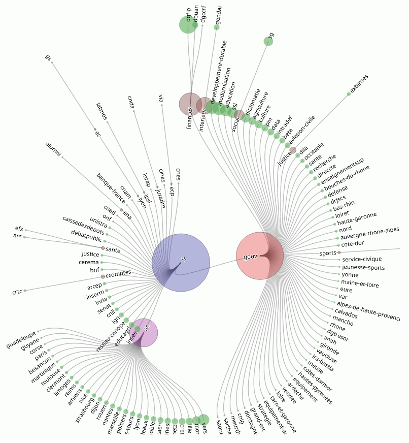

*Le [projet original][origin] est hébergé sur [l'instance gitlab de Framasoft][origin]. D'autres versions peuvent être déployées, notamment sur gitlab ou github, mais il s'agit de mirroirs...*

# Quelques travaux de visualisation de données

pour l'instant, il n'y a qu'un exercice ici, d'autres sont disponibles dans le groupe know-rmandie

## à partir des [données de mastodon.etalab.gouv.fr][datas] (*mastalab*)
les trois premiers vont chercher les données directement dans le [gist][datas]
* arbre hierarchique radial
* diagramme d'accords
* diagramme de Sankey
* diagramme en bulles

## credits
Hand coded with some libraries support :
* [d3][d3] *3.?.?* et *4.8.0*
    * les [exemples][blocks] fournis par Mike Bostock

## parcours
* [framagit][origin] branche > **[frama.io page][frio-page]**
    * [gitlab][gitlab] > **[gitlab page][gl-page]**
        * [github][github] > **[github page][gh-page]**

[origin]:https://framagit.org/sycom/dataviz
[frio-page]:https://sycom.frama.io/dataviz
[gitlab]:https://gitlab.com/sycom/dataviz
[gl-page]:https://sycom.gitlab.io/dataviz
[github]:https://github.com/sycom/dataviz
[gh-page]:https://sycom.github.io/dataviz

[datas]:https://gist.github.com/cquest/bbf1f88f305564fe80a47d7951255eb1#file-domaines-csv
[d3]:https://d3js.org
[blocks]:https://bl.ocks.org/
